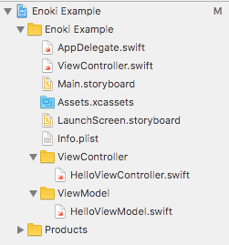

# Enoki

Code generator for Xcode project.
You can manage multiple user-defined file template set in your project.

## Installation

```
$ gem install enoki
```

## Usage

### Setup

Run `enoki init` in your project root directory, then created `.enoki.yml` file with some questions.

### Create template set

Create template set directory in your template directory (default: ./templates) and organize template files. The template file has extension `.tt`.

For example: https://github.com/slightair/enoki/tree/master/examples/Enoki%20Example/templates

```
templates
├── Test
│   └── Enoki\ Example
│       ├── ViewController
│       │   └── __name__ViewController.swift.tt
│       └── ViewModel
│           └── __name__ViewModel.swift.tt
└── VIPER
    └── Enoki\ Example
        └── Modules
            └── __name__
                └── __name__ViewController.swift.tt
```

This example case has 2 template set,  `Test` and `VIPER`.

### Generate source code

Next, run `enoki generate Test Hello` and generated following files.

```
      create  Enoki Example/ViewController/HelloViewController.swift
      create  Enoki Example/ViewModel/HelloViewModel.swift
```

Then added 2 files to your Xcode project and setup project groups that correspond to template set directory tree. 



### File name rule

If you use `__name__` in file or directory name of template, replace to name argument in your command.

For example, generate `Modules/Hello/HelloViewController.swift` from template file `Modules/__name__/__name__ViewController.swift.tt` if your command is `generate TEMPLATE_SET Hello`.

### Template file rule

The template file is ERB template that have extension `.tt`.
Enoki pass name to template engine.

If your template is...

```swift
import UIKit

class <%= name %>ViewController: UIViewController {
    override func viewDidLoad() {
        super.viewDidLoad()
    }
}
```

and run generate command with name `Hello`, then you got following result.

```swift
import UIKit

class HelloViewController: UIViewController {
    override func viewDidLoad() {
        super.viewDidLoad()
    }
}
```

## Contributing

Bug reports and pull requests are welcome on GitHub at https://github.com/slightair/enoki.

## License

The gem is available as open source under the terms of the [MIT License](http://opensource.org/licenses/MIT).